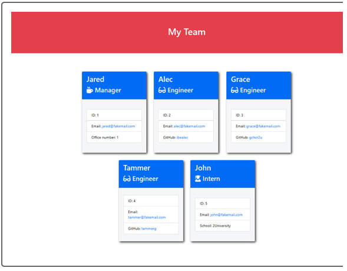

<h1 align='center'>Weekly Assignment Title: FW_team_profile_generator</h1>

### By Likica
#### [Walk-through Video Link](https://www.github.com/likica)
#### [My GitHub Profile](https://github.com/likica) 
#### [📧 Email me](mailto:fahrija_wyroski@live.com)
 

    
    
    
    </a>

    
    
    

## Table of Contents
* [Installation](#installation)
* [Usage](#usage)
* [Features](#features)
* [Images](#images)
* [Tests](#tests)
* [Credits](#credits)
* [Contributing](#contributing)
* [License](#license)

## **Description**
###### [Back to Table of Contents](#Table-of-Contents)
* This application generates a Webpage that displays team's basic info created from user inputs
    - Allows to add new employees (Manager, Engineer, Intern)
* This application is mainly created out of necessity, curiousity and for easier generating team info pages for easy access to your team's basic info. Challenge for beginners but pleasure once it is done!

### **Installation**
###### [Back to Table of Contents](#Table-of-Contents)
1. User needs to have `node.js, vscode, and npm` installed, as well as `npm` dependencies necessary to run this app `(fs, inquirer and jest)`.
2. Afer installing dependencies, app can be run by running `npm index` in your terminal/bash

### **Usage**
###### [Back to Table of Contents](#Table-of-Contents)
1. Once open, the application will prompt the user for input, and
2. After receiving all required inputs, 
3. The application will generate an HTML, which is your Webpage in browser. 

###### [Back to Table of Contents](#Table-of-Contents)
#### **Images**
<h4 align="center" width="100%">
    

    
    
    

#### **Tests**
* Employee.test
* Engineer.test
* Intern.test
* Manager.test

### **Credits**
###### [Back to Table of Contents](#Table-of-Contents)
* UW BootCamp TAs, instructors, my tutor, AskBCS and all other that helped - THANK YOU!

### **Contributing**
###### [Back to Table of Contents](#Table-of-Contents)
* Made with ❤️ by _Likica_ 
- All are welcome to contribute within limits of below stated license

### **License**
###### [Back to Table of Contents](#Table-of-Contents)
 'FW_team_profile_generator' by Likica 2021 All Rights Reserved.
  _All material must be cited or credited, when using material (free to use)._
     
#### **MIT License**

** Permission is hereby granted, free of charge, to any person obtaining a copy of this software and associated documentation files (the "Software"), to deal in the Software without restriction, including without limitation the rights to use, copy, modify, merge, publish, distribute, sublicense, and/or sell copies of the Software, and to permit persons to whom the Software is furnished to do so, subject to the following conditions:

The above copyright notice and this permission notice (including the next paragraph) shall be included in all copies or substantial portions of the Software.

THE SOFTWARE IS PROVIDED "AS IS", WITHOUT WARRANTY OF ANY KIND, EXPRESS OR IMPLIED, INCLUDING BUT NOT LIMITED TO THE WARRANTIES OF MERCHANTABILITY, FITNESS FOR A PARTICULAR PURPOSE AND NONINFRINGEMENT. IN NO EVENT SHALL THE AUTHORS OR COPYRIGHT HOLDERS BE LIABLE FOR ANY CLAIM, DAMAGES OR OTHER LIABILITY, WHETHER IN AN ACTION OF CONTRACT, TORT OR OTHERWISE, ARISING FROM, OUT OF OR IN CONNECTION WITH THE SOFTWARE OR THE USE OR OTHER DEALINGS IN THE SOFTWARE.
###### [Back to Table of Contents](#Table-of-Contents)

_This README was generated by Likica with_ ❤️ 